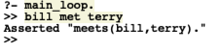
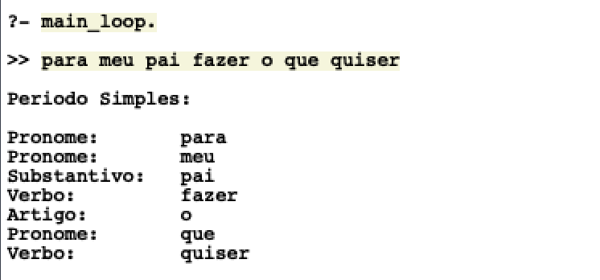
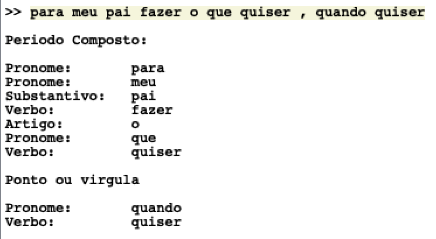

O objetivo do trabalho era implementar de forma funcional o algoritmo do programa TALK, encontrado no livro Prolog and Natural Language Analysis e aplicá-los de forma a também conseguirem interpretar perguntas, além de, caso obtivessemos sucesso nas implementações já citadas, fazer com que o TALK funcionasse como um Chatter-Bot que simula um psicólogo.

O predicado principal do livro foi dado da seguinte forma:

```prolog
main_loop :-
	write('>> '),
	read_sent(Words),
	talk(Words, Reply), 
	print_reply(Reply),
	main_loop.
```

Ao inserir a regra acima no SWI-Prolog e inserirmos um novo fato que esteja de acordo com os nomes próprios e verbos já definidos na base de conhecimento (‘terry met bill’, por exemplo), temos um novo sintagma armazenado dinamicamente na sua base. Assim, se depois verificarmos a regra que foi *assertada,* veremos que ela será verdadeira.



A implementação resultante do trabalho divide-se em duas: a primeira faz uma análise morfossintática da sentença, verificando o tipo de período, se é simples, composto ou pergunta, e a segunda temos um predicado em repetição que simula um diálogo agente-usuário, em que o agente passa por psicólogo. 

Na primeira implementação, para conectarmos a gramática definida em português, pouco aproveitou-se dos sintagmas e predicados originais do algoritmo. O predicado de leitura dos caractéres (read\_sent) da sentença inserida pelo usuário foi mantido. O predicado main\_loop ficou da forma:

```prolog
main_loop :-
	write('>> '),
	read_sent(Words),
	typeOfSentence(Words,Type),
	replySentenceType(Words, Type),
	wordMorphology(Words),
	main_loop.
```

Falaremos individualmente de cada linha.

Na linha 3, o leitor de caracteres, retorna uma lista de todos as palavras (ou caractéres especiais como vírgula, ponto ou interrogação) sem os espaços. Como por exemplo:

Para a entrada ‘bill met terry’, a variável que é passada na declaração do Prolog (no caso do código acima é Words) recebe:

Words = [bill, met, terry].

Na linha 4, verificamos o tipo de sentença que foi inserida pelo usuário, sendo ela dividida em dois grupos tratados de forma diferente: período e pergunta. De maneira simples, verifica-se se na lista há alguma interrogação, se houver, Type recebe o valor ‘question’, se não, recebe o valor ‘assertion’ e passa adiante.

Na linha 5, temos o replySentenceType que verifica a validade da sentença inserida utilizando a gramática em português e após essa verificação, dá um print de cada palavra classificada de acordo com sua morfologia já definida na gramática. O predicado utilizado nessa última ação é o wordMorphology(Sentence), na linha 6, que está demonstrado abaixo. Ele percorre toda a lista com cada palavra da sentença e por meio do operador ‘;’ (ou) faz a verificação em cada classe de palavras existente e printa qual delas estiver de acordo.


```prolog
wordMorphology([]).
wordMorphology([?]).
wordMorphology([Sentence|Rest]) :-
	(pronomeVerify(Sentence);
	artigoVerify(Sentence);
	substantivoVerify(Sentence);
	verboVerify(Sentence);
	adjetivoVerify(Sentence);
	numeralVerify(Sentence);
	adverbioVerify(Sentence);
	preposicaoVerify(Sentence);
	conjuncaoVerify(Sentence);
	interjeicaoVerify(Sentence);
	pontoOuVirgula(Sentence)),
	wordMorphology(Rest).
	
% Exemplo de como funciona um wordVerify
pronomeVerify(Word) :-
	pronome(Num,Gen,[Word],[]),
	write('Pronome:       '),
	write(Word),nl.
```

Por último, temos a linha 7 que faz com que o processo sejá executado novamente e outra frase possa ser analisada. 

Caso não haja mais interesse do usuário de fazer mais análises, inserindo o comando “sair” forçará o programa a ser abortado. Abaxio segue a execução do main\_loop no SWI-Prolog.



---

Implementando o diálogo
-----------------------

Para a segunda parte da implementação, o nível de complexidade exigiu a inserção de muitos novos passos no programa já disponível. O principal predicado do TALK, “main\_loop”, foi alterado da seguinte forma:

```prolog
shrink :-
	write('DICA: NAO USE ACENTOS rsrs'), nl, nl,
	write('Ola, eu sou Shrink, seu terapeuta'),nl,
	write('Como voce esta?'),nl,
	write('>> '),
	read_sent(Words), 
	talk(Words, Reply),  
	shrink_loop(Reply).

shrink_loop(Reply) :-
	nl,write(Reply),nl,
	write('>> '),
	read_sent(Words), 
	talk(Words, NewReply),
	shrink_loop(NewReply). 
```

O predicado ‘shrink’ dá início ao diálogo introduzindo o psicólogo com uma breve apresentação. Vale observar logo de cara que uma limitação de entrada das sentenças do usuário é a utilização de acento nas palavras, pois eles não são reconhecidos pelo predicado de leitura ‘read\_sent’. Na linha 7 e na linha 14, temos o predicado ‘talk’ que foi parcialmente aproveitado do algoritmo original. Abaixo, seguem ambos:

```prolog
% Talk do livro
talk(Sentence, Reply) :-
	parse(Sentence, LF, Type), 							
	clausify(LF, Clause, FreeVars), !,
	reply(Type, FreeVars, Clause, Reply).	

% Talk implementado 
    % talk que encerra o diálogo 
talk([sair],_) :-
	abort.
	
    % talk principal
talk(Sentence, Reply) :-
	typeOfSentence(Sentence,Type),
	parse(Sentence, Type),
	therapist(Sentence,Type,Reply).
    
    % talk de erro na sentença
talk(_Sentence, Reply) :-
	answer(error,Reply).
```

O primeiro talk (linha 8) é apenas definido para encerrar o diálogo. Inserindo ‘sair’, encerramos o programa.

Já o segundo (linha 11), é o principal pedicado para análise da sentença e retorno de uma resposta do psicólogo que esteja dentro do contexto do diálogo. O predicado typeOfSentence define de maneira simples se a sentença inserida é assertiva ou uma pergunta, simplesmente analisando se na lista, criada pelo predicado de leitura dos caracteres, há uma interrogação; em caso afirmativo, o termo Type recebe o valor constante de ‘question’, em caso negativo, recebe ‘assertion’.

No predicado seguinte, a sentença é análisada pela gramática (DCG) em português para verificar se ela faz o mínimo de sentido para ser considerada como uma entrada correta. Caso não seja reconhecida pelo DCG, entramos no último talk, que independe da sentença inserida e dar um valor para o Reply:

```prolog
% Resposta caso a sentença não seja identficada pelo DCG
answer(error, 'Nao entendi sua frase, poderia usar outras palavras?' ).
```

Voltando ao talk principal, o predicado ‘therapist’ identifica a primeira palavra chave (definida como regra) da sentença na sequência da lista — por mais que hajam outras palavras chaves na sentença, apenas a primeira é utilizada — e insere no Reply uma resposta de acordo com ela, fazendo isso da seguinte forma:

```prolog
% 
therapist(Sentence,assertion,Reply) :-
	context(Sentence,Theme),
	answer(Theme,Reply).

therapist(_Sentence,_Type,Reply) :-
	answer(outOfKB,Reply).

context(Sentence,Theme) :-
	subject(Word,Theme),
	member(Word,Sentence).
```

O predicado context usado na linha 4 e definido na linha 9, recebe a lista de palavras da sentença e analisa por meio das regras definidas na base de conhecimento se há uma palavra-chave (utilizando o member(X,List)) na sentença e a que tema ela se relaciona. A regra é da forma:

* subject(pai,familia).
* subject(trabalho,trabalho).
* subject(deprimido,tristeza).
* subject(amigo,amizade).

Encontrando essa palavra-chave e associando ao seu tema, a regra ‘answer’, por meio do tema passado na primeira variável, checa na sua base de conhecimento uma resposta adequada a ele.

* answer(familia, 'Conte-me mais sobre sua familia').
* answer(trabalho, 'Com todo esse trabalho, voce tem tirado tempo pra voce?').
* answer(tristeza, 'Voce conta sobre esse sentimento pra mais alguem?’).
* answer(amizade, 'Algum familiar alem das suas amizades?').

Essas regras e o predicado ‘therapist’ são o coração de toda a interação agente-usuário do programa e quanto maior a base de dados com as regras ‘subject’ e ‘answer’ mais intimista e complexa se torna toda essa intereção. Foram definidas poucas regras dessa apenas para demonstração de exemplos do funcionamento de todo o código.

Uma grande limitação existente nessa parte da implementação é que frases que estão de acordo com a sintaxe definida no DCG e possuem uma das palavras-chave da base de conhecimento mas não fazem qualquer sentido dentro desse contexto, geram interações que também não fazem sentido algum, como mostrado abaixo:

Ola, eu sou Shrink, seu terapeuta

Como voce esta?

\>\> deixou mae

Conte-me mais sobre sua familia

\>\> perder faculdade

Com todo esse trabalho, voce tem tirado tempo pra voce?

\>\> neurocientista triste

Nao entendi sua frase, poderia usar outras palavras?

`​`​Apenas verificou-se se a frase possuía sentido sintático e depois se havia uma palavra-chave sem se preocupar em análisar se a frase fazia sentido e seria algo realmente dito por um paciente num consultório psicológico.

Abaixo segue um teste de diálogo semelhante ao descrito no trabalho:

?- shrink.

DICA: NAO USE ACENTOS rsrs

Ola, eu sou Shrink, seu terapeuta

Como voce esta?

\>\> estou depressivo

Voce conta sobre esse sentimento pra mais alguem?

\>\> para meu pai

Conte-me mais sobre sua familia

\>\> por que eu deveria ?

Por que voce deveria o que ?


